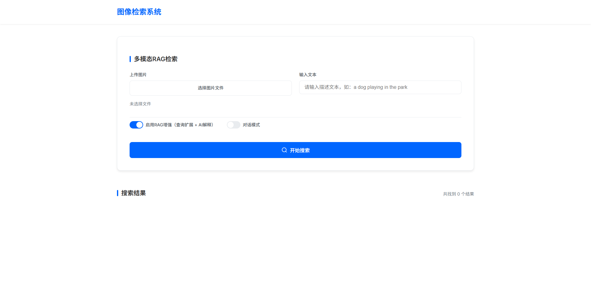
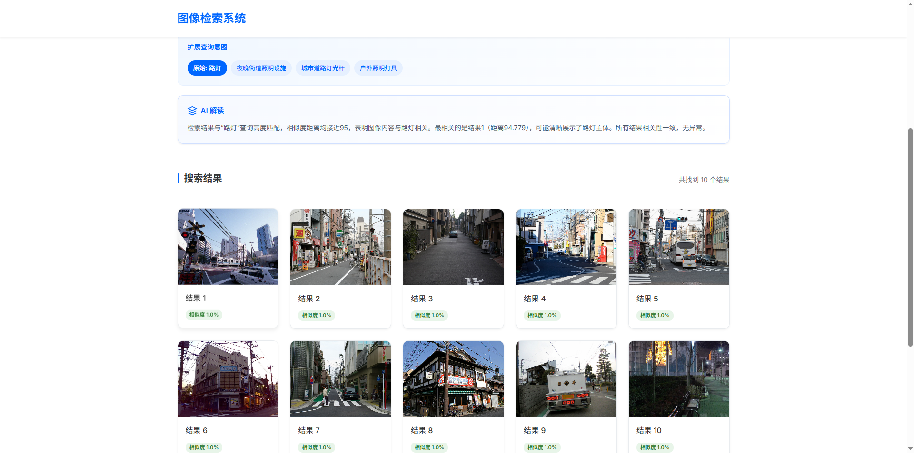

# Image Retrieval

[](https://www.python.org/downloads/)
[](https://pytorch.org/)
[](https://opensource.org/licenses/MIT)

基于 CLIP + Faiss + LLM 的跨模态图像检索引擎。输入文本描述或图片，返回语义最相似的图像。可选集成 LLM（OpenAI 兼容 API）提供查询扩展与结果解释。





## 安装

```bash
pip install -e .

# GPU 加速（可选）
pip install -e .[gpu]
```

## 快速开始

```bash
# 1. 提取 CLIP 特征（首次运行，约 2-4 小时）
python image_feature_extract.py

# 2. 启动服务
python flask_app.py
# → http://localhost:5000
```

### 配置 LLM（可选）

设置环境变量或创建 `.env` 文件：

```
LLM_BASE_URL=https://api.openai.com/v1
LLM_API_KEY=sk-xxx
LLM_MODEL=gpt-3.5-turbo
```

不配置 LLM 则相关功能自动禁用，退化为纯 CLIP + Faiss 检索。

## 原理

**编码**：CLIP (ViT-B/32) 将图像和文本编码到同一 512 维向量空间。图像特征做 L2 归一化，使得 Faiss 中的欧氏距离等价于余弦相似度。

**索引**：Faiss `IVF4096,PQ32x8` 索引。IVF（倒排文件）通过 KMeans 将向量空间划分为 4096 个聚类；PQ（乘积量化）将每个 512 维向量切为 32 段、每段 8 bit 量化，从 2048 字节压缩到 32 字节（64 倍）。

**检索**：查询向量 → 找最近 `nprobe` 个聚类 → 通过 PQ 查找表计算近似距离 → 返回 top-k。

**增量更新**：双缓冲架构，支持动态增删图片而无需重建全量索引。

```
主索引 (Faiss IVF, 已训练)  +  缓冲区 (Python list, 暴力搜索)  +  删除集合 (Set, 逻辑标记)
```

- **Add**：新图片特征进 buffer，O(1)，不动主索引
- **Remove**：ID 加入 `deleted_ids` 集合，搜索时过滤
- **Search**：主索引 + buffer 双路查询，合并排序后过滤删除项，取 top-k
- **Merge**：buffer 超过阈值时追加到主索引，调用 Faiss `add()` — IVF 聚类中心和 PQ 码本不变，无需重新训练
- **Rebuild**：过滤已删除 ID，用剩余数据新建索引并重新训练，是唯一物理删除数据的操作

**LLM 辅助**：LLM 将用户查询扩展为多个语义变体，多路检索后去重融合（按距离排序），再对结果做自然语言解释。Agent 工具以 OpenAI Function Calling 格式暴露。

## API

### 检索

```bash
# 文本搜图
curl -X POST http://localhost:5000/search \
  -H "Content-Type: application/json" \
  -d '{"query": "a dog playing in the park", "topk": 10}'

# 以图搜图
curl -X POST http://localhost:5000/search \
  -F "query_img=@/path/to/image.jpg" \
  -F "topk=10"
```

### LLM 辅助检索

```bash
curl -X POST http://localhost:5000/api/search/rag \
  -H "Content-Type: application/json" \
  -d '{"query": "a dog playing in the park", "topk": 10, "use_expansion": true}'
```

响应：

```json
{
  "original_query": "a dog playing in the park",
  "expanded_queries": [
    "a dog playing in the park",
    "dog running on grass",
    "puppy playing outdoors"
  ],
  "results": [
    {"path": "/data/img_001.jpg", "distance": 0.234, "url": "static/img/img_001.jpg"}
  ],
  "ai_explanation": "...",
  "total_results": 10
}
```

### 增量索引管理

```bash
# 添加图片（进入缓冲区，立即可搜索）
curl -X POST http://localhost:5000/api/index/add \
  -H "Content-Type: application/json" \
  -d '{"image_paths": ["/data/new1.jpg", "/data/new2.jpg"]}'

# 删除图片（逻辑删除）
curl -X POST http://localhost:5000/api/index/remove \
  -H "Content-Type: application/json" \
  -d '{"image_ids": [100, 200]}'

# 合并缓冲区到主索引
curl -X POST http://localhost:5000/api/index/merge

# 重建索引（物理清理已删除数据）
curl -X POST http://localhost:5000/api/index/rebuild

# 查看索引状态
curl http://localhost:5000/api/index/status
```

### Agent 工具

```bash
# 获取工具列表
curl http://localhost:5000/api/tools

# 调用工具
curl -X POST http://localhost:5000/api/tools/call \
  -H "Content-Type: application/json" \
  -d '{"tool": "search_by_text", "arguments": {"query": "sunset beach", "topk": 5}}'
```

### 端点总览

| 端点 | 方法 | 说明 |
|:---|:---|:---|
| `/` | GET | Web UI |
| `/search` | POST | 传统检索 |
| `/api/search/rag` | POST | LLM 辅助检索 |
| `/api/search/expand` | POST | 查询扩展 |
| `/api/rag/qa` | POST | 基于检索图片的问答 |
| `/api/chat` | POST | 多轮对话 |
| `/api/tools` | GET | Agent 工具列表 |
| `/api/tools/call` | POST | 执行 Agent 工具 |
| `/api/index/status` | GET | 索引状态 |
| `/api/index/add` | POST | 增量添加图片 |
| `/api/index/remove` | POST | 逻辑删除图片 |
| `/api/index/merge` | POST | 合并缓冲区 |
| `/api/index/rebuild` | POST | 重建索引 |
| `/api/status` | GET | 系统状态 |

## 架构

```
flask_app.py                    # HTTP 层，14 个端点
    │
    ├── retrieval_by_faiss.py   # CLIPModel + IndexModule + ImageRetrievalModule
    │
    ├── incremental_index_manager.py  # 双缓冲增量索引
    │       └── image_index_builder.py  # 批量特征提取
    │
    ├── llm_interface.py        # LLM 接口（查询扩展/解释/问答）
    │
    └── agent_tools.py          # 4 个 Agent 工具，OpenAI Function Calling 格式
```

| 模块 | 文件 | 职责 |
|:---|:---|:---|
| `CLIPModel` | [retrieval_by_faiss.py](retrieval_by_faiss.py) | 图像/文本 → 512 维向量 |
| `IndexModule` | [retrieval_by_faiss.py](retrieval_by_faiss.py) | Faiss 索引生命周期（训练/检索/追加） |
| `ImageRetrievalModule` | [retrieval_by_faiss.py](retrieval_by_faiss.py) | 统一检索接口（文本/路径/数组） |
| `IncrementalIndexManager` | [incremental_index_manager.py](incremental_index_manager.py) | 双缓冲增量索引管理 |
| `ImageIndexBuilder` | [image_index_builder.py](image_index_builder.py) | 批量 CLIP 特征提取 |
| `LLMInterface` | [llm_interface.py](llm_interface.py) | OpenAI 兼容 LLM 接口 |
| `ImageRetrievalTools` | [agent_tools.py](agent_tools.py) | Agent 工具定义（4 个工具） |

## 基准测试

`demos/` 目录包含在 SIFT1M 数据集（100 万条 128 维向量）上的 ANN 算法基准测试：

| 文件 | 内容 |
|:---|:---|
| [00_lsh_demo.py](demos/00_lsh_demo.py) | LSH 手写实现 |
| [01_faiss_demo.py](demos/01_faiss_demo.py) | Faiss IndexFlatL2, CPU vs GPU |
| [02_pq_benchmark.py](demos/02_pq_benchmark.py) | PQ：子段数(4/8/16/32) × bit数(6-9)，Recall@K 曲线 |
| [03_ivfpq_benchmark.py](demos/03_ivfpq_benchmark.py) | IVF+PQ：聚类中心(128-4096) × nprobe(1-64)，速度-精度权衡 |

结论：`IVF4096,PQ32x8` + `nprobe=64` 在 SIFT1M 上可获得 ~95% Recall@100，单次查询约 20ms（CPU）。

## 配置

参见 [config/base_config.py](config/base_config.py)。主要选项：

| 选项 | 默认值 | 说明 |
|:---|:---|:---|
| `clip_backbone_type` | `ViT-B/32` | CLIP 模型 |
| `index_string` | `IVF4096,PQ32x8` | Faiss 索引类型 |
| `topk` | 20 | 默认返回数量 |
| `image_file_dir` | `train2017/` | 图片目录 |
| `buffer_size_threshold` | 1000 | 缓冲区超过此值时提示合并 |

环境变量（`.env`）：

| 变量 | 说明 |
|:---|:---|
| `LLM_BASE_URL` | OpenAI 兼容 API 地址 |
| `LLM_API_KEY` | API 密钥 |
| `LLM_MODEL` | 模型名称（默认 `gpt-3.5-turbo`） |

## 数据文件

运行 `image_feature_extract.py` 后，`data/` 目录下生成：

| 文件 | 格式 | 内容 |
|:---|:---|:---|
| `feat_mat-{dataset}-{backbone}.pkl` | NumPy ndarray | N×512 特征矩阵 (float32) |
| `map_dict-{dataset}-{backbone}.pkl` | dict | `{faiss_id: image_path}` 映射 |
| `index_state/index_state.json` | JSON | 缓冲区状态、删除集合、next_id |
| `index_state/buffer_features.pkl` | NumPy ndarray | 缓冲区特征矩阵 |

## 测试

```bash
python -m pytest tests/ -v
```

## 参考

本项目改进自 [《PyTorch实用教程（第二版）》第 8.8 章](https://tingsongyu.github.io/PyTorch-Tutorial-2nd/chapter-8/8.8-image-retrieval-2.html) 的图像检索系统。新增内容包括：增量索引管理、LLM 查询扩展、Agent 工具系统、ANN 算法基准测试。

## License

MIT
